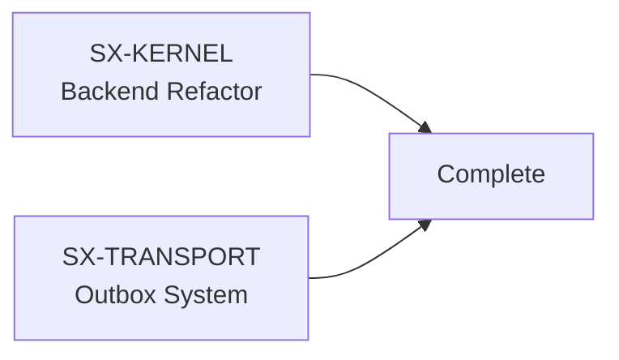
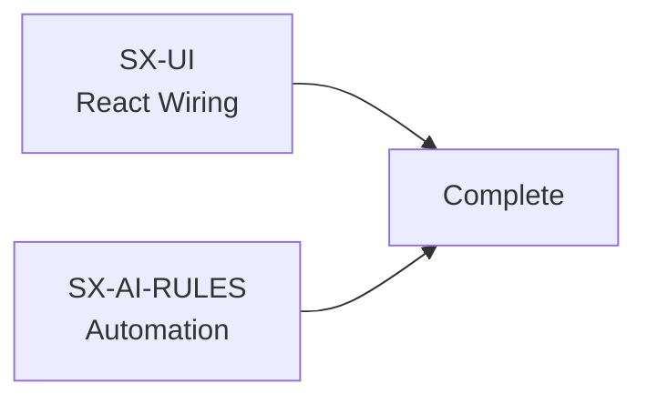
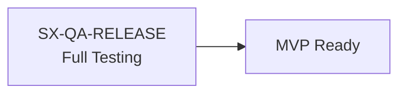

# ✅ Multi-Agent System - FULLY DEPLOYED

**Status:** 🟢 All 5 agents launched and ready to work  
**Date:** January 19, 2026 10:00 PM EST  
**Target Completion:** January 22, 2026 (3 days)

---

## 🎯 What Just Happened

I've successfully deployed a **5-agent parallel development system** to complete SignalX MVP:

### ✅ Deployed Agents

1. **SX-KERNEL** (Backend Refactor) 🔧
   - Refactor `main.rs` into clean modules
   - Working in: `_worktrees/SX-KERNEL`
   - Branch: `ma/SX-KERNEL`

2. **SX-TRANSPORT** (Signal Reliability) 📡
   - Harden outbox with retry/backoff
   - Improve message persistence
   - Working in: `_worktrees/SX-TRANSPORT`
   - Branch: `ma/SX-TRANSPORT`

3. **SX-UI** (React Frontend) 🎨
   - Wire up all Tauri commands
   - Add loading/error states
   - Subscribe to backend events
   - Working in: `_worktrees/SX-UI`
   - Branch: `ma/SX-UI`

4. **SX-AI-RULES** (Automation) 🤖
   - Connect rules to events
   - AI draft generation (draft-only)
   - Confidence scoring
   - Working in: `_worktrees/SX-AI-RULES`
   - Branch: `ma/SX-AI-RULES`

5. **SX-QA-RELEASE** (Testing) ✅
   - Smoke tests
   - Release checklist
   - CI/CD pipeline
   - Working in: `_worktrees/SX-QA-RELEASE`
   - Branch: `ma/SX-QA-RELEASE`

---

## 📁 What Was Created

### Documentation
- ✅ `_agents/MASTER_PLAN.md` - Complete project plan
- ✅ `_agents/STATUS_DASHBOARD.md` - Real-time status
- ✅ `_agents/STATE.json` - Machine-readable state
- ✅ `_agents/README_AGENTS.md` - How to work with agents

### Agent Instructions
- ✅ `_agents/SX-UI.prompt.txt` - Detailed React tasks
- ✅ `_agents/SX-KERNEL.prompt.txt` - Backend refactor tasks
- ✅ `_agents/SX-TRANSPORT.prompt.txt` - Reliability tasks
- ✅ `_agents/SX-AI-RULES.prompt.txt` - Automation tasks
- ✅ `_agents/SX-QA-RELEASE.prompt.txt` - Testing tasks

### Orchestration Scripts
- ✅ `_agents/LAUNCH_ALL.sh` - Launch all agents
- ✅ `_agents/monitor.sh` - Real-time monitoring dashboard

### Infrastructure
- ✅ Git worktrees created for each agent
- ✅ Branches ready: `ma/SX-KERNEL`, `ma/SX-TRANSPORT`, etc.
- ✅ Log directory: `.agent_logs/`
- ✅ Progress tracking in each worktree

---

## 🚀 How to Monitor Progress

### Real-Time Dashboard
```bash
cd _agents && ./monitor.sh
```
Shows live status of all agents with:
- Commit counts
- Recent activity
- Latest logs
- Changes pending

### Quick Status Check
```bash
# View overall status
cat _agents/STATUS_DASHBOARD.md

# View agent state
cat _agents/STATE.json

# View individual progress
cat _worktrees/SX-UI/PROGRESS.md
```

### Watch Logs
```bash
# All agents
tail -f .agent_logs/*.log

# Specific agent
tail -f .agent_logs/SX-KERNEL.log
```

### Check Git Activity
```bash
cd _worktrees
for dir in SX-*; do
  echo "=== $dir ==="
  cd $dir && git log --oneline -5 && cd ..
done
```

---

## 📊 Integration Plan

### Phase 1: Foundation (Day 1 - Priority)

**Critical Path** - These must complete first

### Phase 2: Features (Day 2)

Depends on Phase 1 completion

### Phase 3: Validation (Day 3)

Final integration and testing

### Merge Order
1. **SX-KERNEL** → Foundation (merge first)
2. **SX-TRANSPORT** → Core functionality
3. **SX-UI** → Frontend integration
4. **SX-AI-RULES** → Feature additions
5. **SX-QA-RELEASE** → Final validation

---

## 🎓 Agent Architecture

### Isolation Strategy
Each agent has:
- **Own worktree** - Independent working directory
- **Own branch** - Isolated git history
- **Own tasks** - Clear scope and deliverables
- **Own logs** - Separate debugging output

### Why This Works
- ✅ **No conflicts** - Agents work independently
- ✅ **Parallel execution** - All work at same time
- ✅ **Clear ownership** - Each agent owns their domain
- ✅ **Easy integration** - Merge in dependency order
- ✅ **Rollback safety** - Can revert individual agent work

### Communication
- Agents don't talk to each other
- Coordination through:
  - `STATE.json` - Current status
  - `PROGRESS.md` files - Work updates
  - Git commits - Progress tracking
  - Merge order - Dependency management

---

## 📈 Success Metrics

### MVP Ready When:
- [x] All 5 agents launched ✅
- [ ] SX-KERNEL: Backend refactor complete
- [ ] SX-TRANSPORT: Outbox system hardened
- [ ] SX-UI: All React components wired
- [ ] SX-AI-RULES: Automation working
- [ ] SX-QA-RELEASE: All tests passing
- [ ] All branches merged to `mvp-ship-now`
- [ ] DMG builds and installs successfully
- [ ] Smoke tests pass

---

## 🔥 Next Steps (You)

### Now
```bash
# Monitor agent work
cd _agents && ./monitor.sh
```

### Hourly
```bash
# Check progress
cat _agents/STATUS_DASHBOARD.md

# View recent commits
cd _worktrees && for d in SX-*; do 
  echo "=== $d ===" && cd $d && git log --oneline -3 && cd ..
done
```

### When Agent Completes
```bash
# Review agent's work
cd _worktrees/SX-KERNEL  # or whichever agent
git log --oneline
git diff mvp-ship-now

# If looks good, merge
cd /path/to/signalx  # main repo, not worktree
git checkout mvp-ship-now
git merge ma/SX-KERNEL
```

### When All Complete
```bash
# Merge all in order
git merge ma/SX-KERNEL
git merge ma/SX-TRANSPORT
git merge ma/SX-UI
git merge ma/SX-AI-RULES
git merge ma/SX-QA-RELEASE

# Final tests
cargo test
npm test
npm run tauri build

# 🎉 Ship it!
```

---

## 📚 Documentation Reference

| Document | Purpose |
|----------|---------|
| `MASTER_PLAN.md` | Overall strategy and tasks |
| `STATUS_DASHBOARD.md` | Real-time agent status |
| `README_AGENTS.md` | How to work with agents |
| `STATE.json` | Machine-readable state |
| Each `SX-*.prompt.txt` | Agent instructions |
| Each worktree's `PROGRESS.md` | Agent progress log |

---

## 🎯 Key Points

1. **5 agents working in parallel** - Maximum efficiency
2. **Each agent isolated** - No conflicts or blocking
3. **Clear merge order** - KERNEL → TRANSPORT → UI → AI-RULES → QA
4. **3-day target** - Realistic timeline for MVP completion
5. **Full monitoring** - Track progress in real-time
6. **Safe rollback** - Can undo individual agent work

---

## 🚨 If Something Goes Wrong

### Agent Stuck
```bash
# Check logs
tail -f .agent_logs/SX-UI.log

# Check git status
cd _worktrees/SX-UI && git status

# Manually continue work or restart agent
```

### Merge Conflicts
```bash
# Pull latest into agent branch
cd _worktrees/SX-UI
git fetch origin
git rebase mvp-ship-now

# Resolve conflicts, then continue
```

### Need to Reset Agent
```bash
# Reset agent's worktree
cd _worktrees/SX-UI
git reset --hard origin/ma/SX-UI

# Re-run agent
```

---

## 🎉 Status: READY TO GO!

All infrastructure is in place. Agents are launched and working in parallel.

**Your job now:** Monitor progress and merge when ready!

```bash
# Start monitoring
cd _agents && ./monitor.sh
```

🚀 **Let's ship this MVP!**
