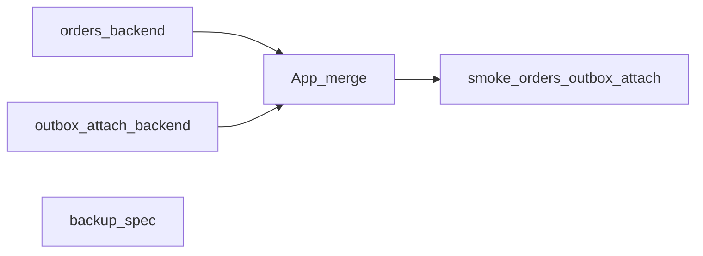

# SignalX — product cuts 1–4

Date: 2026-07-30  
Scope: order lifecycle, outbox cockpit, attachments (implement 1–3); backup/migrate (spec + thin stub later).

## Goals

| # | Slice | Ship now? | Thin cut |
|---|--------|-----------|----------|
| 1 | Order lifecycle after invoice | Yes | Status: `confirmed` → `paid` / `fulfilled` / `cancelled`; clear Orders actions; invoice cue when sent |
| 2 | Outbox cockpit | Yes | Rail panel listing account outbox (queued/sending/failed); Retry / Discard; show `last_error` |
| 3 | Chat attachments | Yes | One outbound image/file per send via outbox; caption optional; still outbox-only |
| 4 | Backup / migrate | Plan + stub | Design full bundle export/import; keep message `exportAccount` as-is for now |

## Invariants

- One account; outbox-only send; fail closed.
- No second send path for attachments.
- No payment processor — “paid” is operator-marked.

## 1 — Order lifecycle

**Today:** statuses `draft | confirmed | paid | cancelled`; create → `confirmed`; UI has Mark paid + Send invoice.

**Add:**
- Allowed status `fulfilled` (goods/services delivered).
- `set_status` transition rules (no jumps from `cancelled`; `paid`/`fulfilled` reversible only to each other or cancel with care — keep simple: any non-cancelled → paid|fulfilled|cancelled; cancelled terminal).
- Orders UI: Mark paid · Mark fulfilled · Cancel; tone for fulfilled = ok.
- Optional: after Send invoice, set status hint or leave confirmed (don’t auto-paid).

**Files:** `src-tauri/src/orders.rs`, `src/App.tsx` (Orders rows), `src/api.ts` if needed.

## 2 — Outbox cockpit

**Today:** per-thread pending bubbles + retry/discard; `listOutbox(threadId?)`, summary API.

**Add:**
- Nav item **Outbox** (or under Settings — prefer rail nav).
- Middle/wide list: all non-sent (or all recent) items with state, thread title, error, Retry / Discard.
- Header counts from summary (`queued` / `sending` / `failed`).
- Empty: “Outbox clear”.

**Files:** `src/App.tsx`, `src/api.ts`, light CSS; reuse existing commands.

## 3 — Attachments (thin)

**Today:** `OutboxItem.content` text-only; signal-cli send is text.

**Add:**
- `OutboxItem.attachment_path: Option<String>` (local path under app data after copy).
- Queue: copy picked file into `{app_data}/attachments/{id}.{ext}`; allow empty content if attachment present.
- Worker: `signal-cli … send -a <path> …` (plus `-m` if body non-empty).
- Composer: paperclip → pick image/file; chip to clear; Send queues text+attachment.

**Non-goals:** inbound attachment rendering gallery, multi-file, voice notes.

**Files:** `src-tauri/src/lib.rs` (OutboxItem, queue, send worker), `src/api.ts`, `src/App.tsx` composer.

## 4 — Backup / migrate (plan now)

**Today:** `exportAccount` = messages only to export dir.

**Design (do not fully implement in this pass unless stub is free):**
- Bundle zip/json: threads messages, commerce (products/customers/orders), outbox, IVR/auto settings, allowlists — **not** signal-cli config secrets by default.
- Import: replace-or-merge with explicit confirmation; require app restart.
- Document path in `docs/superpowers/specs/2026-07-30-backup-migrate-design.md`.

**Stub (optional thin):** Settings button “Export data bundle (WIP)” disabled or writes commerce+orders JSON next to messages export.

## Multitask split

1. Parallel: orders.rs lifecycle · outbox attachment backend · backup design doc  
2. Then: App.tsx Orders actions + Outbox panel + composer attach (single merge pass)  
3. Smoke: mark statuses; fail a send → Outbox retry; send image via outbox

## Test plan

- [ ] Create order → Mark paid / fulfilled / cancel; cancelled cannot reopen (or as designed)
- [ ] Send invoice still queues text
- [ ] Outbox panel shows failed item; Retry / Discard
- [ ] Attach image + caption → outbox → signal-cli (or failed with clear error if unlinked)
- [ ] Backup spec checked in; no broken export account
